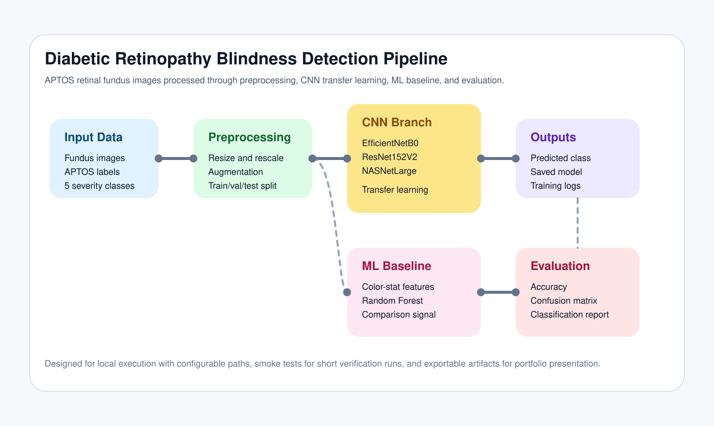
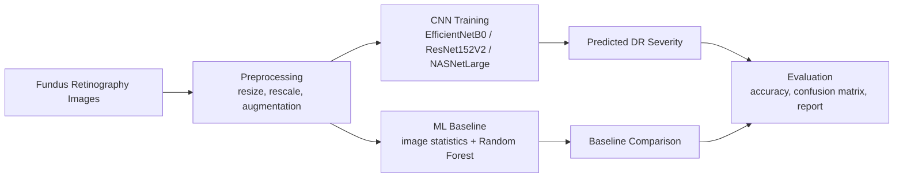

# Diabetic Retinopathy Benchmark [](https://deepwiki.com/vermashaurya/CNN-Health)


Blindness detection from diabetic retinopathy fundus images using transfer learning CNN backbones and a classical machine-learning baseline.



## Overview

This repository is the polished, GitHub-ready version of a final-year B.Tech Computer Science capstone project. It focuses on automated diabetic retinopathy grading from retinal fundus photographs and packages the work as:

- a configurable CNN training pipeline
- a classical ML baseline for comparison
- evaluation artifacts for reproducibility
- a GitHub Pages UI in `docs/` for presentation

The project no longer depends on the old Kaggle-only directory layout and works from a clean local structure.

## GitHub Pages UI

**Live at** - https://vermashaurya.github.io/CNN-Health <br><br>
[](https://vermashaurya.github.io/CNN-Health/)

The repository includes a static presentation site in `docs/` designed for GitHub Pages. It explains:

- project motivation and pipeline
- backbone comparison
- result surfaces and evaluation outputs
- implementation details
- future scope

Once the repo is on GitHub, enable Pages from the `docs/` folder and the UI becomes the public-facing project page.

## Pipeline



## Repository Structure

```text
diabetic-retinopathy-benchmark/
├── docs/                     # GitHub Pages UI
├── data/
│   └── aptos2019-blindness-detection/
│       ├── train.csv
│       └── train_images/
├── main.py                   # Final CLI entrypoint
├── efficientnet.py           # Backbone shortcut
├── resnet152v2.py            # Backbone shortcut
├── nasnetlarge.py            # Backbone shortcut
├── diagrams.py               # Diagram generator
├── requirements.txt
└── README.md
```

## Dataset Layout

Expected local structure:

```text
data/
└── aptos2019-blindness-detection/
    ├── train.csv
    └── train_images/
        ├── 000c1434d8d7.png
        └── ...
```

If your dataset lives elsewhere, override the default paths with CLI flags.

## Installation

```bash
pip install -r requirements.txt
```

## Usage

Smoke test:

```bash
python3 main.py train --backbone efficientnetb0 --smoke-test
```

Final training run:

```bash
python3 main.py train --backbone efficientnetb0 --epochs 30
```

Classical ML baseline:

```bash
python3 main.py baseline
```

Backbone-specific shortcuts:

```bash
python3 efficientnet.py
python3 resnet152v2.py
python3 nasnetlarge.py
```

## Model Comparison

| Model | Input Size | Role in Repo | Characteristics |
| --- | --- | --- | --- |
| `EfficientNetB0` | `256x256` | Recommended default | Good balance of accuracy and efficiency |
| `ResNet152V2` | `224x224` | Deep residual benchmark | Strong feature extraction with higher depth |
| `NASNetLarge` | `331x331` | High-capacity benchmark | Larger model with heavier compute cost |
| `RandomForestClassifier` | Handcrafted features | Classical ML baseline | Useful non-deep-learning comparison |

## Result Artifacts

The training pipeline exports:

- `best_model.keras`
- `final_model.keras`
- `training_log.csv`
- `history.csv`
- `evaluation.json`
- `run_summary.json`

The baseline writes its own outputs to `artifacts/baseline/`.

This repository intentionally does not fabricate performance numbers. Once you run your final training locally, the generated artifacts become the source of truth for reported metrics.

## Resume Summary

> Built a diabetic retinopathy grading pipeline on retinal fundus images using transfer learning CNN backbones (`EfficientNetB0`, `ResNet152V2`, `NASNetLarge`) and a classical ML baseline, with configurable training, experiment logging, evaluation exports, and a GitHub Pages showcase UI.

## License

This project is licensed under the MIT License - Checkout [LICENSE](LICENSE) for details. <br><br>
[](LICENSE)
